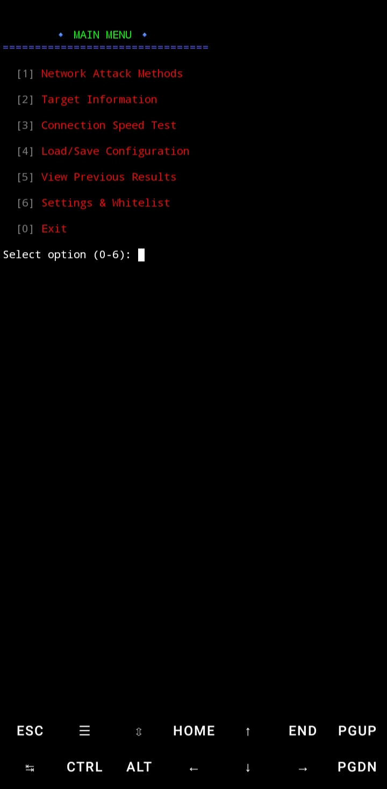

# [Wifi-Attack]

[](https://www.python.org/)
[]()

No Description

## 🖼️ Screenshot
| Tampilan |
| :---: |
|  |
| *Tempilan Sederhana Tools* |

## Support 
- Termux

## 🛠️ Installation

### 📋 Requirements:
- 🐍 **Python 3.x** (Download from [python.org](https://www.python.org/))
- 💻 **A terminal** (Command Prompt, Termux, PowerShell, Linux shell)

### 🚀 Steps:

1. **Instalasi**
   ```bash
   pkg update -y && pkg upgrade -y
   pkg install python -y
   pkg install python2 -y
   pkg install python3 -y
   pkg install git -y
   ```
   

1. **Clone the repository:**
   ```bash
   
   git clone https://github.com/Biodata-Projects/Wifi-Attack.git
   cd Wifi-Jammer
   
   ```


2. **Install required libraries:**
   ```bash
   pip3 install colorama requests
   ```
   - 🌈 **colorama:** For colorful console magic.
   - 🌐 **requests:** For HTTP attack power.


3. **Run the tool:**
   ```bash
   python3 Wifi-Attack.py
   ```

---
